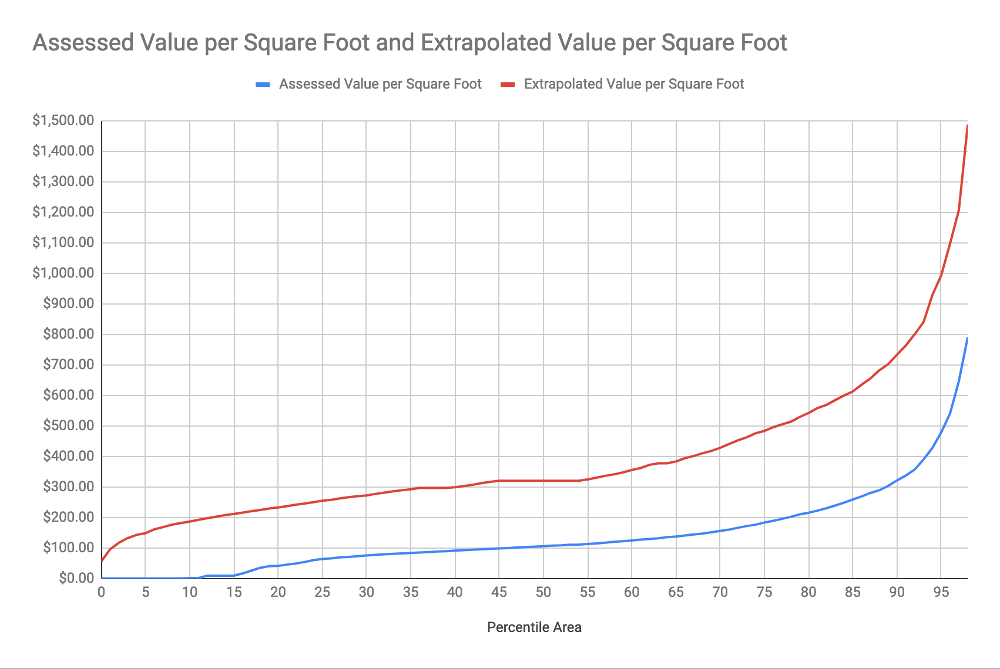

# Estimated Land Value in San Francisco

> *NOTE*: I am working on making a map of the 4,356 blocks in San Francisco
> which were sampled to come up with the estimate of $265 Billion of total
> land value.

This estimate looks at the 2018-19 property tax assessment data provided by
the Office of the Assessor-Recorder of the City and County of San Francisco.

Due to Proposition 13, the tax assessments of properties tend to be far
below market value the further in the past the last change of ownership is.
The Python script in this repository uses any parcel with a sale in the past
decade as a sample of the land value of that entire block (while also
estimating that the land value has appreciated at a rate of 3% per year over
the assesed value since the date of the last sale). This accounts for only
13% of all parcels but includes nearly 82% of all city blocks.

These sampled blocks have a total land area of 22 square miles (most of the
habitable land in San Francisco) and estimates a total land value of $265 for
those sampled blocks.
